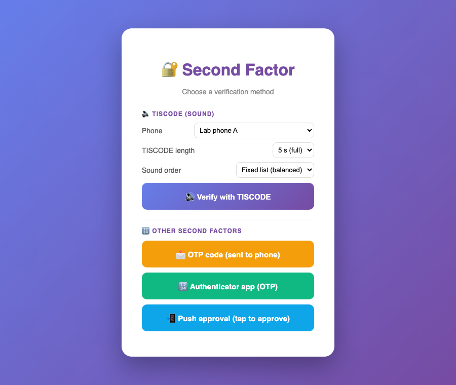
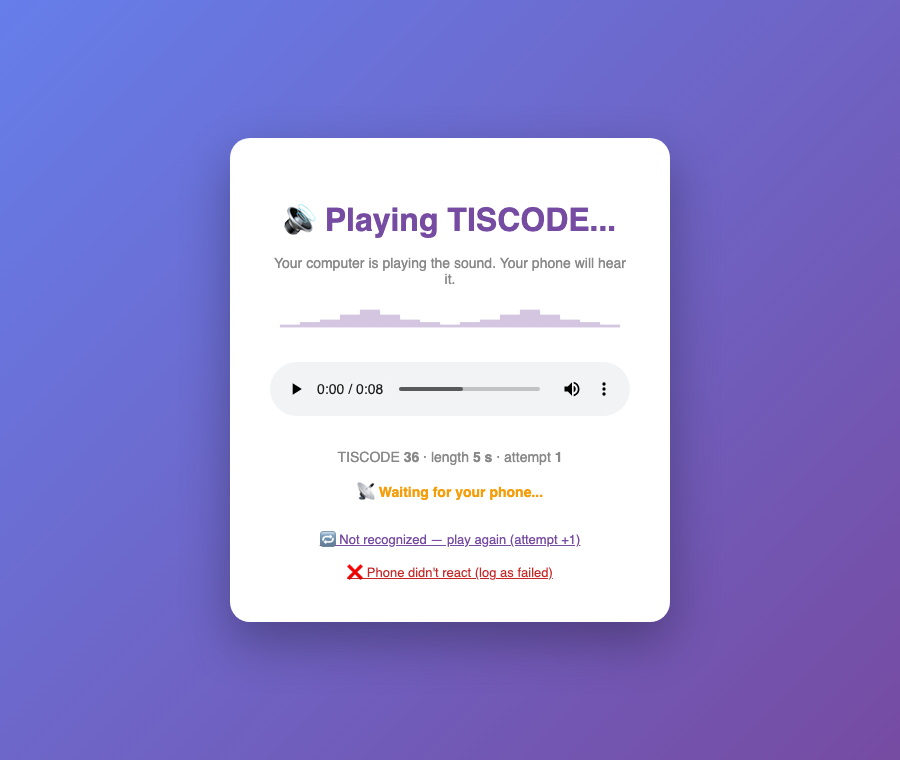
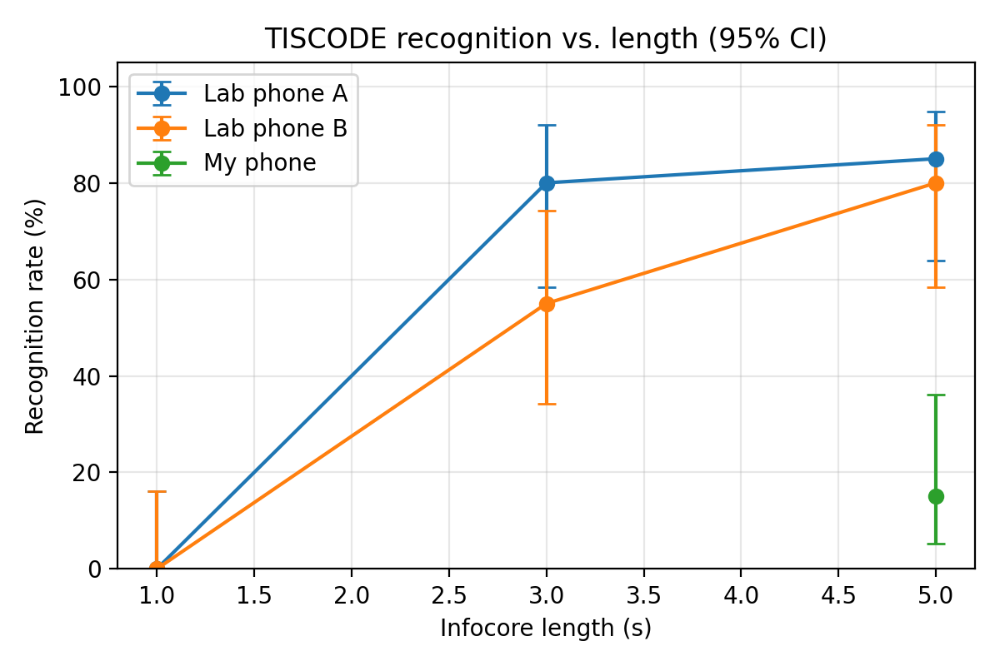
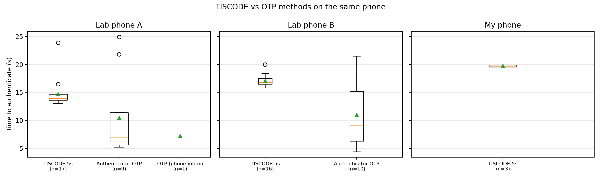

# TISCODE 2FA proof of concept

A small web login that uses a TISCODE (a short sound code) as the second factor.
Built during my Erasmus+ internship at the University of Padova, October 2026.



## How it works

After the password, the user picks TISCODE. The browser plays a short sound
(an opening marker followed by an infocore). The TISCODE app on the phone
recognises it and shows a notification. Tapping the notification opens the
`/ack` link, which completes the login on the website.

Because the code travels as sound, the login only succeeds when the phone is
in the same room as the computer.



For comparison the demo also has three common second factors:

- a 6-digit code sent to the phone (simulates SMS / e-mail, shown on the `/inbox` page)
- an Authenticator app code (TOTP, RFC 6238, works with Google Authenticator; set up at `/totp-setup`)
- a push approval ("Is this you?" with Approve / Deny on the `/inbox` page)

## Results so far

Two lab phones (Huawei Honor 9X and Motorola Moto E7), 20 sounds, 3 lengths.
With the full 5 s infocore TISCODE was recognised on the first try in 80-85% of
trials; 3 s worked on one phone but not the other, and 1 s never worked.



On the same phones an Authenticator code was faster (median 7-9 s against
14-17 s for TISCODE) but much less consistent.



## Running it

```bash
pip install -r requirements.txt
python3 app.py          # http://localhost:5002
```

The demo account is `demo@tiscode.test` / `demo` unless you create a
`.demo_login` file (first line e-mail, second line password). Phones must be on
the same network and open `http://<computer-IP>:5002/inbox` for the code and
push methods.

Running locally starts in experiment mode: a phone selector, a fixed balanced
list of sounds, retry / "not recognised" buttons, and every trial is written to
`results.csv`. Set `EXPERIMENT_MODE=false` for the plain demo.

## Files

- `app.py` - the Flask web app (login, all second factors, experiment logging)
- `analyze.py` - recognition rates (95% Wilson intervals), timing statistics
  (Mann-Whitney U) and the charts; needs `pip install -r requirements-analysis.txt`,
  then `python3 analyze.py`
- `inspect_sounds.py` - measures where the opening marker and infocore start in
  each sound file and finds duplicate files (source of the constants in `app.py`)
- `results.csv` - the trials from 7 October 2026
- `static/` - the TISCODE sound files

## Deploying

The public demo runs on Render with
`gunicorn -w 1 --threads 8 -b 0.0.0.0:$PORT app:app` (one worker, because the
login state is kept in memory) and these environment variables:
`DEMO_EMAIL`, `DEMO_PASSWORD`, `EXPERIMENT_MODE=false`, `FLASK_SECRET`,
`TOTP_SECRET`. The TISCODE links on the platform point to
`https://<app>.onrender.com/ack`.

## Known limitations

- The `/ack` link has no per-login secret: anyone who calls it while a login is
  waiting would confirm that login. A real deployment needs a one-time token in
  the link for each login.
- One login at a time (state in memory), plain-text demo password check.
- The TISCODE app still needs one tap on the notification; confirming
  automatically (zero-touch) is future work.
- iPhone trials and a 2 s / 4 s infocore are still to be done.
